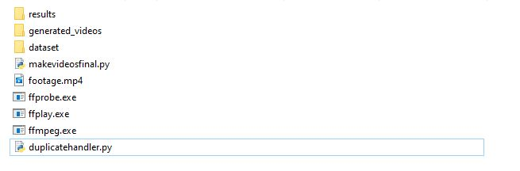

# Reddit-TikTok-Content-Generator
Scrapes Reddit subreddits  
Parses the data  
Text to speech  
Generates mp4s with gameplay in the background

*WIP
</img>

Assemble a json file of scraped reddit data (2 files: submissions.json and comments.json) -- https://github.com/pistocop/subreddit-comments-dl  
Put all data in submissions.json in json category: submissions  
Put all data in comments.json in json category: comments  

Install needed modules/libraries 
Run makevideosfinal.py 
Run duplicatehandler.py 

